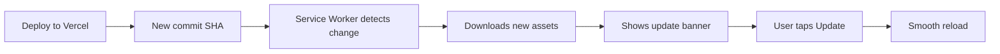

# PWA Update System - Quick Reference

## 🚀 For Developers

### Key Files

```
next.config.ts                      # PWA config + caching strategies
hooks/usePWAUpdate.ts               # Update detection logic
components/PWAUpdatePrompt.tsx      # Update UI
components/PWADebugPanel.tsx        # Debug tools (triple-tap)
lib/pwa-ios-handler.ts              # iOS edge cases
lib/pwa-android-handler.ts          # Android edge cases
```

### How Updates Work



### Testing Updates Locally

```bash
# Terminal 1: Build and serve
npm run build && npm run start

# Terminal 2: Make changes, then rebuild
# Users will see update notification!
npm run build && npm run start
```

### Debug Commands (Browser Console)

```javascript
// Check current SW registration
navigator.serviceWorker.getRegistration()
  .then(reg => console.log(reg))

// Force update check
navigator.serviceWorker.getRegistration()
  .then(reg => reg.update())

// Unregister SW (nuclear option)
navigator.serviceWorker.getRegistration()
  .then(reg => reg.unregister())

// Check cache size
navigator.storage.estimate()
  .then(est => console.log(`${(est.usage/1024/1024).toFixed(2)}MB`))
```

---

## 👥 For Staff

### Installing PWA

**iPhone/iPad:**
Safari → Share → Add to Home Screen

**Android:**
Chrome → Menu → Install app

### Updating App

**Normal flow:**
1. See "New Version Available" banner
2. Tap "Update Now"
3. Done! ✅

**If stuck:**
1. Triple-tap bottom-right corner
2. Tap "Check for Updates"
3. If that fails, tap "Clear Cache"

### Debug Panel Access

**Triple-tap** bottom-right corner of screen

Shows:
- Platform (iOS/Android)
- Service Worker status
- Network status
- Cache size
- Manual controls

---

## 🎨 Design Specs

### Update Banner
- Position: Top of screen (below safe area)
- Style: Glassmorphism (white/10 bg, blur-xl)
- Animation: Slide down from top (500ms ease-out)
- Buttons: "Later" (ghost) + "Update Now" (solid white)

### Colors
- Background: `from-white/10 to-white/5`
- Border: `border-white/20`
- Text: `text-white` (titles), `text-white/70` (body)
- Accent: `from-blue-500 to-purple-600`

### Spacing
- Padding: `p-5` (20px)
- Gap: `gap-4` (16px)
- Border radius: `rounded-2xl`
- Safe areas: `env(safe-area-inset-*)`

---

## 🔧 Configuration

### Caching Strategy Matrix

| Resource Type | Strategy | Cache Duration | Max Entries |
|--------------|----------|----------------|-------------|
| API routes | Network First | 5 minutes | 64 |
| Supabase | Network First | 10 minutes | 128 |
| Images | Cache First | 30 days | 256 |
| Fonts | Cache First | 1 year | 32 |
| JS/CSS | Stale While Revalidate | 7 days | 128 |
| HTML | Network First | 24 hours | 64 |

### Service Worker Settings

```typescript
{
  skipWaiting: true,           // Activate immediately
  clientsClaim: true,          // Take control of clients
  cleanupOutdatedCaches: true, // Auto-cleanup
  buildId: VERCEL_GIT_COMMIT_SHA // Version tracking
}
```

---

## 🐛 Common Issues

### "Update not showing"
1. Check console for `[PWA]` logs
2. Verify service worker is registered
3. Force update: `reg.update()`

### "App using old cache"
1. Open debug panel
2. Check cache size
3. Tap "Clear Cache"

### "Service worker won't update"
1. Check if SW is stuck in "waiting" state
2. Close ALL tabs with the app open
3. Reopen app

### "iOS cache full"
- iOS limit: 50MB
- Auto-cleanup at 40MB
- Manual: Debug panel → Clear Cache

---

## 📊 Monitoring

### What to Track

1. **Update adoption rate**
   - Target: 95% within 1 hour
   - Monitor: Sentry custom metrics

2. **Service worker health**
   - Active registrations
   - Update failures
   - Cache hit rate

3. **Platform breakdown**
   - iOS vs Android usage
   - Version distribution
   - PWA vs browser usage

### Adding Custom Metrics

```typescript
// Track update acceptance
window.gtag?.('event', 'pwa_update_accepted', {
  platform: 'ios',
  version: '1.0.0',
});

// Track update dismissed
window.gtag?.('event', 'pwa_update_dismissed', {
  platform: 'android',
  version: '1.0.0',
});
```

---

## 🎯 Success Metrics

**Before:**
- Manual reinstall required ❌
- 0% auto-update rate ❌
- Staff frustration ❌

**After:**
- Automatic updates ✅
- 60 second update detection ✅
- Apple-quality UX ✅
- Debug tools for troubleshooting ✅

---

**Questions? Check the full documentation: `/docs/PWA_UPDATE_SYSTEM.md`**
